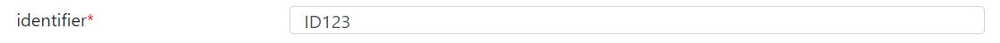
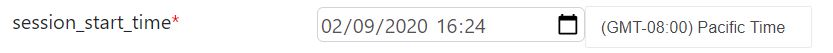
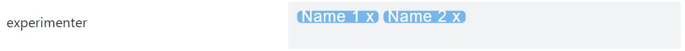
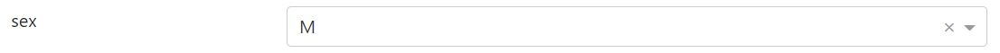
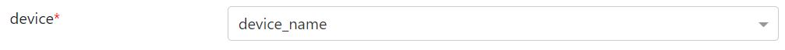
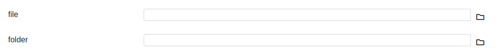
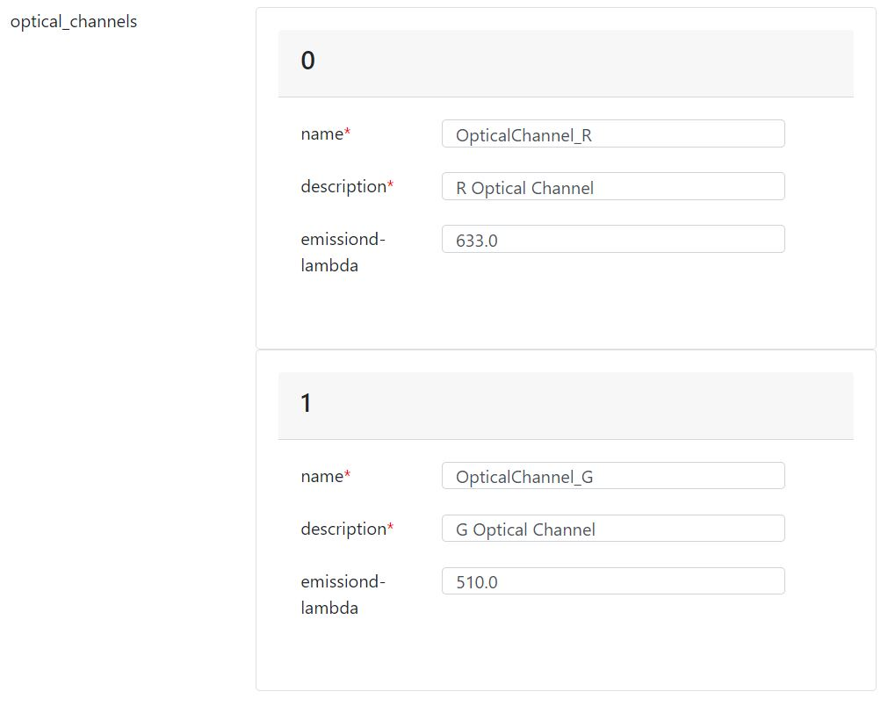
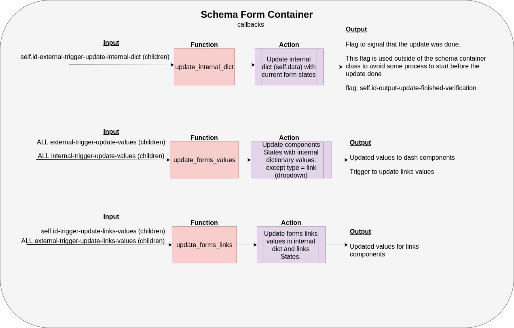

## Definitions

A **Form** is a [Card component](https://dash-bootstrap-components.opensource.faculty.ai/docs/components/card/) that has as children a list of **Fields**.

A **Field** is a [FormGroup component](https://dash-bootstrap-components.opensource.faculty.ai/docs/components/form/) that has two children in the same row: Label and Input.

The Input of each **Field** varies according to the type of data for each property. The Input type must be defined in the incoming schema and the Input value should be provided by the data.

## Schema / Data / Component examples

### String field

<table>
<tr>
<td>Schema</td>
<td>Data JSON</td>
<td>Data YAML</td>
</tr>
<tr>
<td>
<pre lang="json">
"NWBFile": {
  "properties": {
    "identifier": {
        "type": "string"
    }
  }
}
</pre>
</td>
<td>
<pre lang="json">
"NWBFile": {
	"identifier": "ID123"
}
</pre>
</td>
<td>
<pre lang="yaml">
NWBFile:
  identifier: ID123
</pre>
</td>
</tr>
</table>

### Numeric field

<table>
<tr>
<td>Schema</td>
<td>Data JSON</td>
<td>Data YAML</td>
</tr>
<tr>
<td>
<pre lang="json">
"ImagingPlane": {
  "properties": {
    "excitation_lambda": {
  	  "type": "number"
  }
}
</pre>
</td>
<td>
<pre lang="json">
"ImagingPlane": {
  "excitation_lambda": 588
}
</pre>
</td>
<td>
<pre lang="yaml">
ImagingPlane:
  excitation_lambda: 588
</pre>
</td>
</tr>
</table>

### Datetime field

<table>
<tr>
<td>Schema</td>
<td>Data JSON</td>
<td>Data YAML</td>
</tr>
<tr>
<td>
<pre lang="json">
"NWBFile": {
  "properties": {
    "session_start_time": {
      "type": "string",
      "format": "date-time"
    }
  }
}
</pre>
</td>
<td>
<pre lang="json">
"NWBFile": {
   "session_start_time": "2020-09-02T16:24:00"
}
</pre>
</td>
<td>
<pre lang="yaml">
NWBFile:
  session_start_time: 2020-09-02T16:24:00
</pre>
</td>
</tr>
</table>

### Tags field

<table>
<tr>
<td>Schema</td>
<td>Data JSON</td>
<td>Data YAML</td>
</tr>
<tr>
<td>
<pre lang="json">
"NWBFile": {
  "properties": {
    "experimenter": {
      "type": "array",
      "items": {"type": "string"}
    }
  }
}
</pre>
</td>
<td>
<pre lang="json">
"NWBFile": {
	"experimenter": ["Name 1", "Name 2"]
}
</pre>
</td>
<td>
<pre lang="yaml">
NWBFile:
  experimenter:
    - Name 1
    - Name 2
</pre>
</td>
</tr>
</table>

### String choice field

<table>
<tr>
<td>Schema</td>
<td>Data JSON</td>
<td>Data YAML</td>
</tr>
<tr>
<td>
<pre lang="json">
"Subject": {
  "properties": {
    "sex": {
      "type": "string",
      "enum": ["M", "F", "U", "O"],
      "default": "U"
    }
  }
}
</pre>
</td>
<td>
<pre lang="json">
"Subject": {
  "sex": "M"
}
</pre>
</td>
<td>
<pre lang="yaml">
Subject:
  sex: M
</pre>
</td>
</tr>
</table>

### Link choice field

<table>
<tr>
<td>Schema</td>
<td>Data JSON</td>
<td>Data YAML</td>
</tr>
<tr>
<td>
<pre lang="json">
"ImagingPlane": {
  "properties": {
    "device": {
      "type": "string",
      "target": "pynwb.device.Device"
    }
  }
}
</pre>
</td>
<td>
<pre lang="json">
"ImagingPlane": {
  "device": "device_name"
}
</pre>
</td>
<td>
<pre lang="yaml">
ImagingPlane:
  device: device_name
</pre>
</td>
</tr>
</table>

### Folder/File field

<table>
<tr>
<td>Schema</td>
<td>Data JSON</td>
<td>Data YAML</td>
</tr>
<tr>
<td>
<pre lang="json">
"DirectoryFileForm": {
  "type": "object",
  "properties": {
    "file_field": {
      "type": "string",
      "format": "file",
      "description": "a path to file field"
    },
    "dir_field": {
      "type": "string",
      "format": "directory",
      "description": "a path to directory field"
    }
  }
},
</pre>
</td>
<td>
<pre lang="json">
"DirectoryFileForm": {
  "file": "path/to/file",
  "directory": "path/to/dir"
}
</pre>
</td>
<td>
<pre lang="yaml">
DirectoryFileForm:
  file: "path/to/file"
  directory: "path/to/dir"
</pre>
</td>
</tr>
</table>

### Boolean field

<table>
<tr>
<td>Schema</td>
<td>Data JSON</td>
<td>Data YAML</td>
</tr>
<tr>
<td>
<pre lang="json">
"BooleanForm": {
  "type": "object",
  "properties": {
  "some_boolean_option": {
      "type": "boolean",
      "default": true,
      "description": "a boolean field"
    }
  }
},
</pre>
</td>
<td>
<pre lang="json">
"BooleanForm": {
  "some_boolean_option": true
}
</pre>
</td>
<td>
<pre lang="yaml">
BooleanForm:
  some_boolean_option: true
</pre>
</td>
</tr>
</table>

### Subform list field

<table>
<tr>
<td>Schema</td>
<td>Data JSON</td>
<td>Data YAML</td>
</tr>
<tr>
<td>
<pre lang="json">
"ImagingPlane": {
  "properties": {
    "optical_channels": {
      "type": "array",
      "minItems": 2,
      "maxItems": 2,
      "items": [
        {"$ref":  "#/definitions/OpticalChannel"}
      ]
    }
  }
}
</pre>
</td>
<td>
<pre lang="json">
"ImagingPlane": {
  "optical_channel": [
    {
      "name": "OpticalChannel_R",
      "description": "R Optical Channel",
      "emission_lambda": 633.0
    },
    {
      "name": "OpticalChannel_G",
      "description": "G Optical Channel",
      "emission_lambda": 510.0
    }
  ]
}
</pre>
</td>
<td>
<pre lang="yaml">
ImagingPlane:
  optical_channel:
    - description: R Optical Channel
      emission_lambda: 633.0
      name: OpticalChannel_R
    - description: G Optical Channel
      emission_lambda: 510.0
      name: OpticalChannel_G
</pre>
</td>
</tr>
</table>

## Callback Definitions

### Schema Form Container
The Schema Form Container is the "exposed" container containing a Form object and all the callbacks to handle with the Form data.
This callbacks can be triggered from external objects

